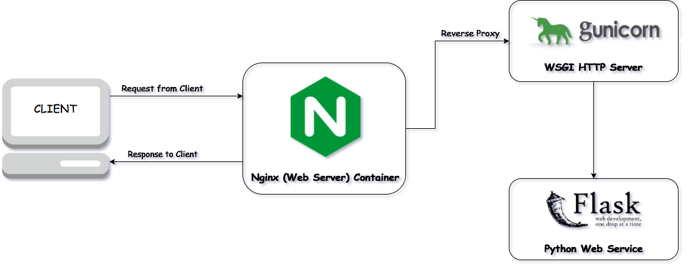

# GimmeShelter-Hackaton-2016
Module 1 of the Tampa FL THHI GimmeShelter 2016 Hackaton

Description:
> A mobile app is to be designed to capture quality, consistent data for the PIT Homeless counts. The app would capture the GPS location coordinates for each survey conducted to assist in understanding where within their community’s unsheltered individuals and families are encountered, providing valuable information for deployment of services.
Point in time count

For more information please consult the Digital PIT Census Reference.

## Setting Up for Development
```
pip install flask pymongo pygal mongod pandas numpy
```
## Setting up for Production
Run these additional steps after `Setting Up for Development`
```
yum install nginx (or apt-get install nginx)
pip install gunicorn
```

### Securing MongoDB
1. Install mongo command line
2. `mongo`
3. `use admin`
4. `db.createUser({user: "<admin_user>", pwd: "<admin_password>", roles: [{ role: "userAdminAnyDatabase", db: "admin" }]});`
5. `db.auth("<admin_user>", "<admin_password>")`
11. `use pit`
12. `db.createUser({ user: "<user>", pwd: "<password>", roles: [{ role: "dbOwner", db: "pit" }] })`
13. `exit`
14. edit the mongodb config file:
    1.  Location:
            1.  LINUX: `/etc/mongod.conf`
            2.  MAC: `/usr/local/etc/mongod.conf`
    2.   And uncomment security and 
            1.  FEDORA: set `authorization: "enabled"`
            2.  UBUNTU: set `auth = true`
            3.  MAC: add all 
                ```
                security:
                    authorization: enabled
                ```
1.  Restart mongodb
    1.  FEDORA: `sudo service mongod restart`
    2.  UBUNTU: `sudo service mongodb restart`
    3.  MAC: `brew services restart mongodb`
2.  Put `<user>` and `<password>` in pitconfig.ini under [database]
3.  Now you should be unable to connect to the pit unless you're using the new user.

## Running for Development
For development, the app can be ran by invoking the Flask backend server directly. Do not use the built-in Flask server in production.
```python
pip install flask pymongo pygal
mongod
python pitapp/backend.py
```

## Running production on AWS
The current setup is to have the Flask application ran and managed by GUnicorn. Nginx is the pubic-facing reverse proxy that handles HTTPs and reroutes traffic to the running GUnicorn web application. The Flask app will reside on port 5000 and Nginx is set to forward traffic there.



### Expected system configuration:
1. PIT App resides at `/home/ec2-user/PITCensus`. Also expected to exist is `/home/ec2-user/PITCensus/pitapp` from which GUnicorn will run.
2. The TLS certificates `fullchain.pem` (the public certificate chain) and `privkey.pem` (the private key) exist in the `pitapp` directory.

### Setup
1. Install the Nginx and systemd configuration files: `sudo cp -r production-config/etc /`
1. Start the PIT App: `sudo systemctl start pit_app`
1. Start Nginx: `sudo systemctl restart nginx`
1. Enable the PIT app and Nginx on boot:
1. - `sudo systemctl enable nginx`
1. - `sudo systemctl enable pit_app`
1. Browse to `https://pitapp.thhi.org` or wherever the front end will sit.

After systemd is configured in this manner, the app and Nginx will start upon system boot.

## Running Tests
Tests use [pytest](https://docs.pytest.org/en/latest/) and [mock](https://docs.python.org/dev/library/unittest.mock.html).
1. `pip install mock`
1. `pip install -U pytest`
1. From the base directory: `pytest test/`

### Stress Tests
The stress tests (`test_stress_load.py`) will use the currently running MongoDB instance and write mock data under a `pit.stress_test` table. `stress_test` here is used in place of where the year is normally placed.

The test assumes the MongoDB instance is authenticated according to the `pitconfig.ini` of the applications.

## The API Key
All API requests require an API key for authentication. This is a single key shared among all volunteers, and the survey cannot start without first validating the key.

The survey page will start with an input asking for the key; the answer is stored as the `dataAuthKey` value under the `[web]` section in pitconfig.ini.

This key will be sent when submitting a survey once the data collection is complete to prevent unauthorized data entries.

## Survey in Action


